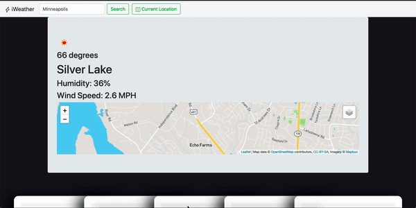

# iWeather --
- Displays Weather Information in a beautiful UI
- Displays Rader Information
- Gets Users Current Location
- User can Search for Cities to view weather data
- Uses Local Storage or Firebase to save users information for the future

- Uses Openweather API, HTML5 Geolocation API
